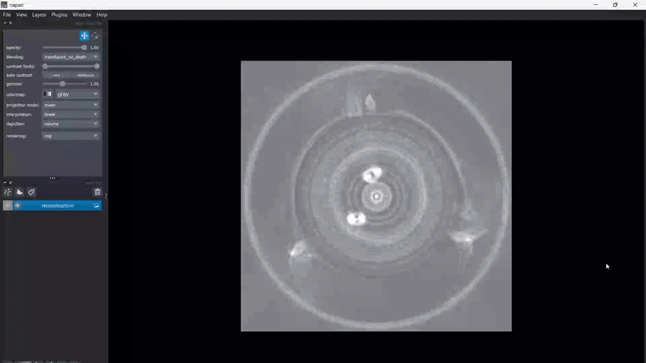
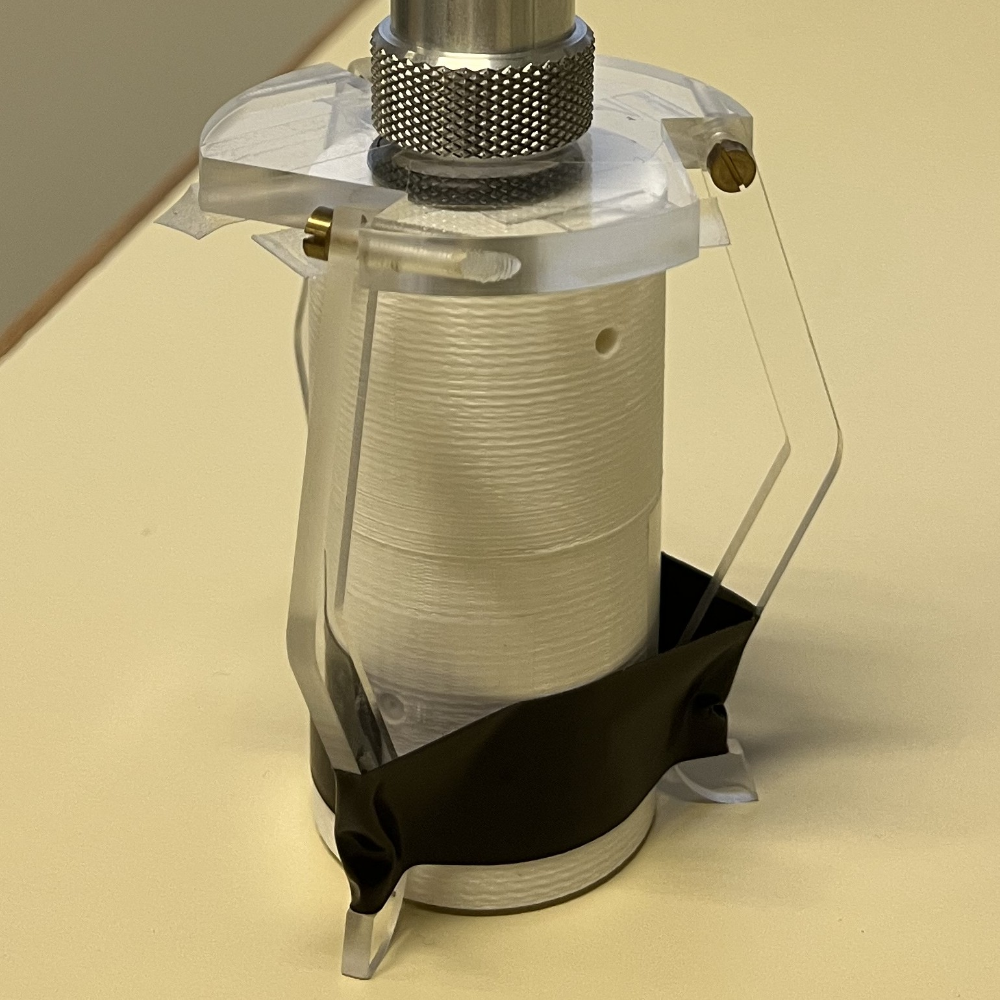
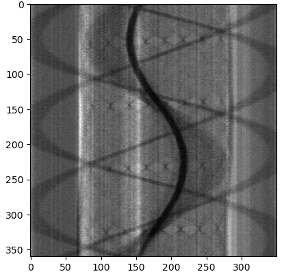

# CBCT-Reconstruction


> A 3D volume reconstruction algorithm from 2D x-ray projections, written in Python.

<p align="center">
  
</p>

<p align="center">
  <em>3D CBCT reconstruction (FDK algorithm, napari visualization)</em>
</p>

<p align="center">
  &nbsp;&nbsp;&nbsp;&nbsp;
  
</p>

<p align="center">
  <em>Test object (left) and one sample sinogram (right)</em>
</p>


## 📖 About this project

This project was started as part of my second year of Master's degree. It aims at reconstructing 3D volumes from 2D projections of a rotating sample obtained via x-rays imaging. 

It is an extension of the classical CT Filtered Back Projection (FBP) algorithm: instead of considering x-rays parallel to the detector (with an x-ray source at infinity), we consider a point source that emits x-rays in all directions with a detector of finite size placed at finite distance. The x-rays thus arrive following a cone shape. This is the mathematical principle of **Cone Beam Computerized Tomography (CBCT)**.

The data already available in the repo was acquired experimentally using a custom CT-scan setup, requiring an initial physical calibration to determine the exact geometric parameters (source-to-object and object-to-detector distances) used in the reconstruction pipeline.


## 🔬 Brief introduction

Cone Beam Computerized Tomography is an advanced medical and industrial imaging modality where a divergent cone-shaped X-ray beam acquires 2D projections of an object over a 360-degree rotation. Unlike conventional fan-beam CT, CBCT captures a volumetric dataset in a single rotation, significantly reducing acquisition time.

This repository implements the **Feldkamp-Davis-Kress (FDK) algorithm**, which is an analytical 3D reconstruction method that extends the 2D FBP to a cone-beam geometry. The reconstruction pipeline consists of four main steps: 

### 1. Attenuation conversion (Beer-Lambert law)
X-ray photons are attenuated exponentially as they pass through the object. The measured transmitted intensity $I$ is converted into line integrals of the linear attenuation coefficient $\mu$:

$$\large p(u,v,\beta)=-\ln\left(\frac{I(u,v,\beta)}{I_0}\right)=\int\mu(x,y,z)ds$$

Where $I_0$ is the unattenuated (air) intensity and $\beta$ is the projection angle.

### 2. Cone-beam cosine weighting
To account for the divergent nature of the X-ray beam, the planar projection data is pre-weighted by the cosine of the ray angle:

$$\large p_w(u,v,\beta)=p(u,v,\beta)\frac{D}{\sqrt{D^2+u^2+v^2}}$$

Where $D$ is the experimentally calibrated source-to-object distance (assuming a virtual detector plane scaled to the isocenter), and $u$ and $v$ are the orthogonal coordinates on this virtual 2D detector.

### 3. Ramp filtering
To suppress the $1/r$ low-frequency blurring artifact inherent to the back-projection process, the weighted projections are filtered row-by-row in the frequency domain using a **Ram-Lak filter** (or ramp filter):

$$\large P_f(\omega,v,\beta)=P_w(\omega,v,\beta)\cdot|\omega|$$

The inverse Fourier transform yields the filtered sinograms $p_f(u, v, \beta)$.

### 4. Voxel-driven back-projection
Finally, the filtered 2D projections are smeared back into the 3D object space $(x, y, z)$. Because our experimental rotation axis is horizontal, the volume is reconstructed slice by slice along the X-axis of the images. A distance-dependent magnification weight $1/U^2$ is applied during the back-projection to correct for the divergent geometry:

$$\large f(x,y,z)=\int_{0}^{2\pi}\frac{D^2}{U^2(x,y,\beta)}p_f(u',v',\beta)d\beta$$

Where $U$ is the orthogonal distance from the X-ray source to the voxel $(x,y,z)$ projected along the central ray.


## 📂 Repository structure

```Plaintext
CBCT-Reconstruction
├── data                     # directory for subdirectories containing the projection images
│   ├── 360                  # 360 projections of a sample object (cylinder with internal and external structures)
│   ├── 15                   # 15 sparse projections of the same object
│   └── 4                    # 4 extremely sparse projections
├── LICENSE.md               # MIT license
├── README.md                # this documentation
└── reconstruction.py        # entry point and main algorithm
```


## ⚙️ Installation & dependencies

To run this project, you will need the following Python libraries: `numpy`, `matplotlib`, `tifffile`, `scikit-image`, and `scipy`.

```bash
git clone https://github.com/thmspllgr/CBCT-Reconstruction.git
cd CBCT-Reconstruction
pip install numpy matplotlib tifffile scikit-image scipy
```


## 🚀 Usage

1. **Prepare your data:** \
   Place your 2D projection images (e.g., `.png`, `.tif`) in the data directory. By default, the script looks for files in `CBCT-Reconstruction/data/360`, and the directory already contains some data. The script automatically sorts files sequentially (e.g., `img1.png`, `img2.png`, ...) so try to name them in the right order.

2. **Configure geometry:** \
   If you are using a different hardware setup, update the geometric parameters at the top of `reconstruction.py` to match your physical acquisition system:
   ```python
   D = 30.87        # source-to-object distance (cm)
   d = 14.9         # object-to-detector distance (cm)
   pixel_size = ... # detector pixel pitch (cm)
   ```

3. **Run the reconstruction:** \
   Execute the Python script:
   ```bash
   python reconstruction.py
   ```
   
4. **Analyze the output:** \
   The process will write its progress every 50 slice in the terminal. Upon completion, the reconstructed 3D volume will be saved in the root directory as `reconstruction.tif`. This 3D TIFF file can be opened and analyzed using scientific visualization softwares (**ImageJ/Fiji**, **3D Slicer**, **ParaView**...). I personally use **napari**, by simply running:
   ```bash
   pip install "napari[all]"
   napari reconstruction.tif
   ```


## Notes

1. **Extracting a sinogram** \
If you want to get a sample sinogram, just add this inside the reconstruction loop:

```Python
if x == 125:    # or any other slice index
    tifffile.imwrite("sinogram.tif", norm.astype(np.float32))
```

2. **Extracting a 2D slice** \
To get a 2D slice from the 3D reconstruction, add this inside the loop:

```Python
if x == 125:
    tifffile.imwrite("slice.tif", reconstructed.astype(np.float32))
```

3. **Benchmarking with skimage** \
To compare this implementation with the standard iradon function from `scikit-image` (which uses the Ram-Lak filter by default), replace the filtering and backprojection calls with:

```Python
from skimage.transform import iradon
reconstructed = iradon(density.T, theta=theta, circle=True)
```
